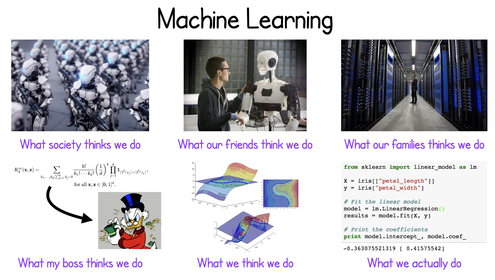

<!-- _class: title -->

# Welcome to the ML Course
## Machine Learning for Science & Discovery

**MSU REU 2026**

---

# About Me

**Prof. Danny Caballero**
- Physics Education Research (PER) background (PhD, Georgia Tech)
- Research in STEM education, computational modeling, and machine learning
- At MSU PA since 2013, joined CMSE in 2021
- Worked with machine learning in research and teaching
- Enjoy teaching ML using real data, asking real questions, solving real problems

*This class is about **doing ML like a researcher does**: asking questions, building intuition, learning from failure.*

---

# What This Class Looks Like

## Format
- **Slides + Activities**: Theory and framing in slides, hands-on coding in Jupyter notebooks
- **Real datasets**: Not toy data, but working with research problems that you'll encounter
- **Work in pairs/groups**: You learn better together; science is collaborative
- **Ask questions**: No such thing as a dumb question. If you're confused, others are too.

## What We'll Build
By the end of the class, you'll have built **classifiers, regressors, and model pipelines** on a real dataset.

---

# What is Machine Learning?

---

# Supervised Learning as a Framework

## Not a magic algorithm. A systematic process you'll repeat.

1. **Understand** — Ask a real question about your data
2. **Explore** — Clean data, spot patterns, prepare for modeling
3. **Build** — Train a model on labeled examples
4. **Evaluate** — Test on held-back data. Does it work?
5. **Improve** — Refine or try a different approach (↻ loop back)

---

# Learning by Doing

You won't just see code—you'll **write it, break it, fix it, understand it**.

This is messy. That's the point.

- Day 1: **Load real data** (it's broken, we'll find it)
- Days 2–3: **Build models** (classification, regression, tuning)
- Day 4: **Put it together** (real workflow, start to finish)

*By the end, you'll have **intuition** about how Supervised ML actually works.*

---

# A Note on Struggle

## Machine learning is hard. So is programming.

**This is normal.** Scientists struggle with new tools all the time. What matters is:
- You try
- You read documentation
- You ask for help
- You learn from what breaks

*I'm here to help you get unstuck, and I don't have all the answers.*

---

# Let's Start With Introductions

## Tell us:
- Your name and where you're from
- One thing you're curious about (in ML, science, or anything)
- One thing you're excited to learn in this class

*We'll go around the room. Keep it short—30 seconds each.*

---

# Today's Goal

## By the end of today, you'll:
1. Load a real dataset (100,000 astronomical objects)
2. Spot problems in the data before analysis
3. Visualize relationships between features
4. Understand what makes a good question to ask with data

