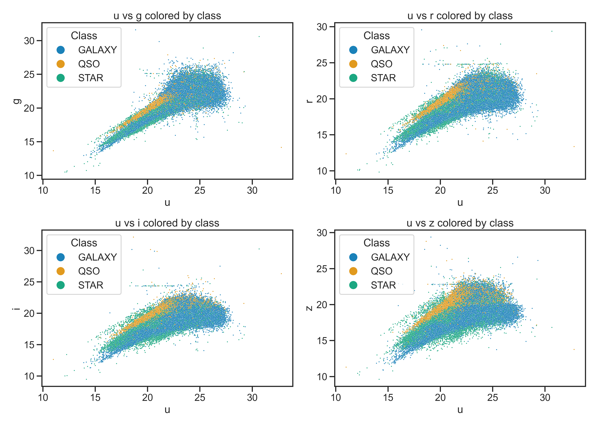
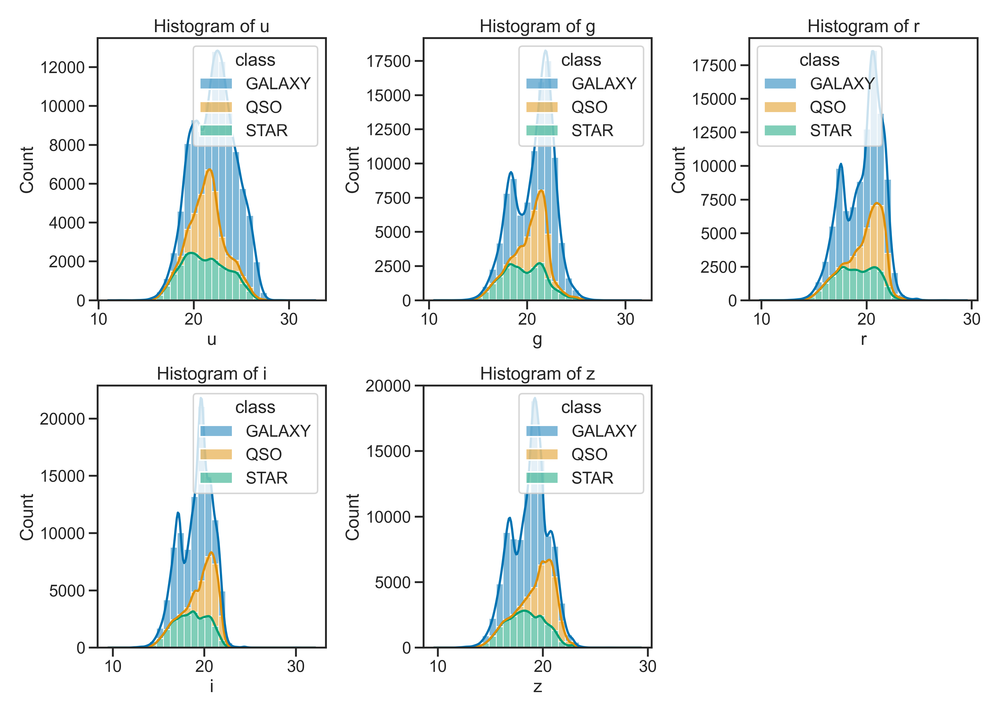
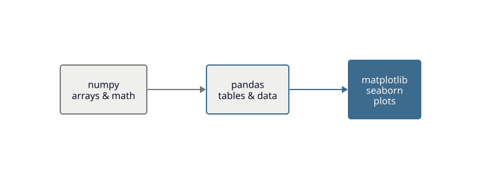
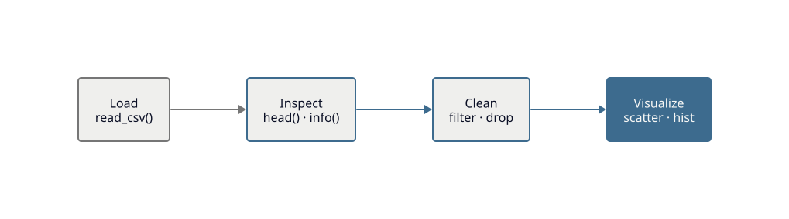

<!-- _class: title -->

# Day 01
## Exploring Data with `pandas`

MSU REU Machine Learning Short Course

---

# The Dataset — SDSS

**Sloan Digital Sky Survey**: 100,000 observations, 17 features, three classes.

| Class | What it is |
|---|---|
| STAR | A nearby star in our galaxy |
| GALAXY | A distant galaxy |
| QSO | A quasar — the bright core of a very distant galaxy |

We'll use this same dataset all week.

> The dataset is at `activities/data/star_classification.csv`

---

<!-- _class: img-full -->

# What does the data look like?

Five photometric color bands: `u  g  r  i  z` — brightness at different wavelengths.



---

<!-- _class: img-full -->

# Distributions by class

Redshift `z` separates classes dramatically. Color bands? Less so.



---

# The Scientific Python Stack

We'll use three libraries throughout the course.



- **numpy** — fast array math, the foundation everything else builds on
- **pandas** — labeled tables (like a spreadsheet, but scriptable)
- **matplotlib / seaborn** — plots

---

# The EDA Loop

Exploratory data analysis always follows the same four steps.



You'll run this loop many times — each pass teaches you something new.

---

# Key pandas commands

```python
import pandas as pd

df = pd.read_csv("data/star_classification.csv")  # load
df.head()          # first 5 rows
df.info()          # column types, nulls
df.describe()      # summary statistics

# filter: remove rows where any band is negative
df = df[df["u"] > 0]

# select columns
features = df[["u", "g", "r", "i", "z"]]
```

---

# Today's Activity

Work through **Activity 01: Exploring Data with pandas**

1. Load and inspect the SDSS dataset
2. Clean it — remove invalid photometric values
3. Make scatter plots and histograms colored by class
4. Answer: which features separate classes best?

> **Before you start:** [Python Review](../notes/python_review.ipynb) if you need a refresher
> **Docs:** [pandas](https://pandas.pydata.org/docs/) · [seaborn](https://seaborn.pydata.org/tutorial.html)
