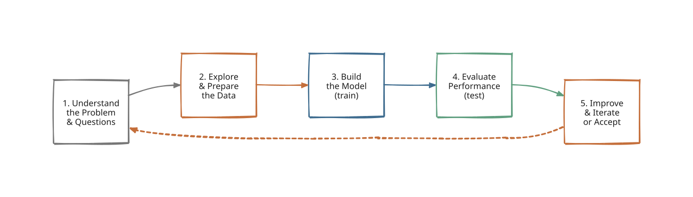
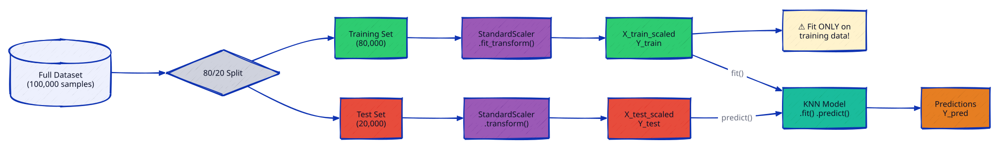
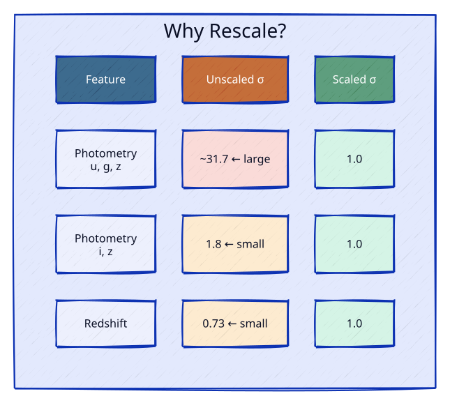
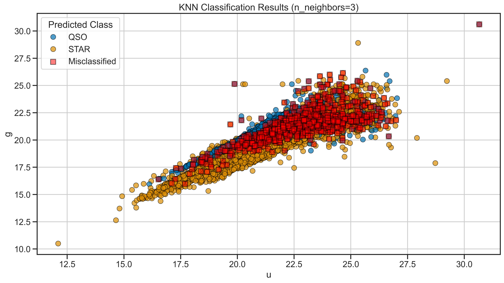
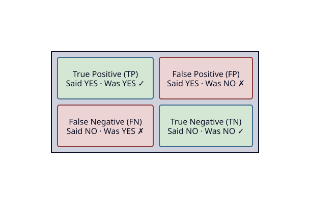
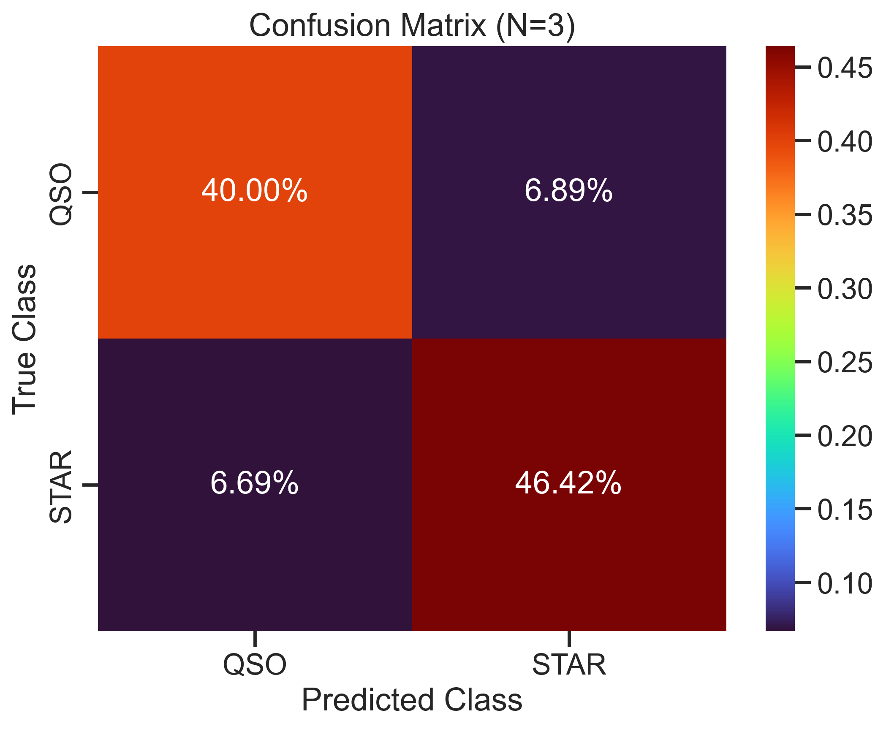
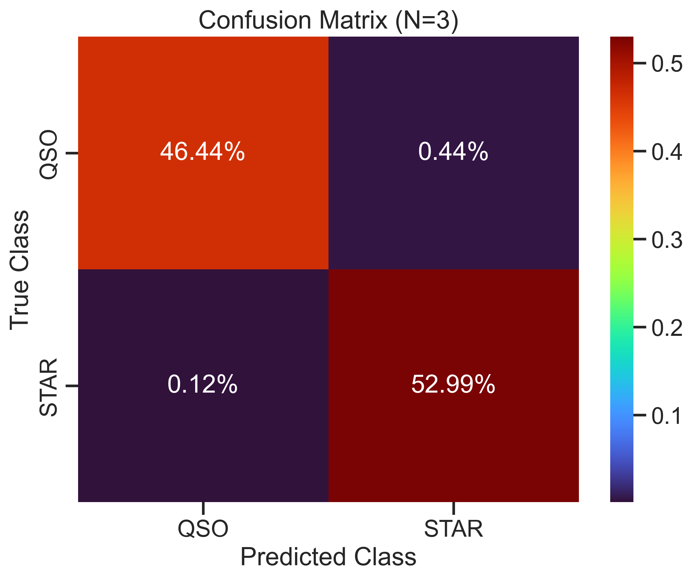
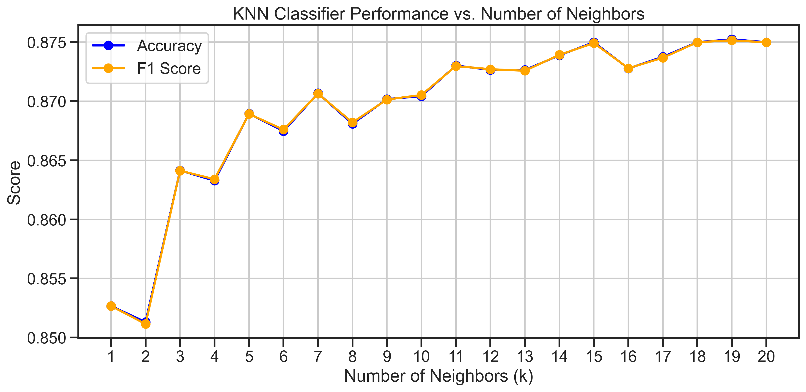

<!-- _class: title -->

# Day 02: Classification with KNN
## using `scikit-learn`

MSU REU Machine Learning Short Course

---

# Learning Goals for Today

By the end of this activity, you'll be able to:

1. **Describe the ML pipeline**: this is the same structure you'll reuse for most models
2. **Split and scale data** correctly, and explain *why* each step matters
3. **Build and train a KNN classifier** using `scikit-learn`
4. **Evaluate a model** with precision, recall, F1, and the confusion matrix
5. **Improve a model** by adding features and tuning hyperparameters

This is the workflow professional data scientists use every day.

---

# From Exploration to Modeling

Last week: *which features might separate classes?*

Today: we build a model that makes that separation automatic.

| | Day 01 | Day 02 |
|---|---|---|
| Goal | Understand the data | Predict the class |
| Tools | `pandas`, `seaborn` | `scikit-learn` |
| Output | Plots and intuitions | A trained classifier |

**Same dataset. New question:** can a machine learn the rules?

---

# The ML Pipeline



Every model you build in class follows this same structure — for classification *and* regression.

---

# Train / Test Split



---

# Train / Test Split

**Why?** You can't evaluate yourself on data you learned from.

```python
from sklearn.model_selection import train_test_split

X_train, X_test, y_train, y_test = train_test_split(X, y, test_size=0.2, random_state=42)
```

- 80% trains the model
- 20% evaluates it — *unseen data*
- `random_state=42` makes splits reproducible

---

# Feature Scaling

## **Why?** KNN uses *distance*. 

Redshift ranges 0–7, photometry 10–33. Without scaling, redshift dominates every distance calculation (*smaller distances are closer neighbors*).

```python
from sklearn.preprocessing import StandardScaler

scaler = StandardScaler()
X_train_scaled = scaler.fit_transform(X_train)
X_test_scaled  = scaler.transform(X_test)
```

*Fit on training data only — then apply the same transformation to test.*

---

<!-- _class: img-full -->



---

# KNN — You Are Your Neighbors

To classify a new point, find the *k* closest training points and take a majority vote.



---

# Building the Model

The `scikit-learn` pattern is nearly the same for every algorithm.

```python
from sklearn.neighbors import KNeighborsClassifier
from sklearn.metrics import classification_report, confusion_matrix

knn = KNeighborsClassifier(n_neighbors=3)
knn.fit(X_train_scaled, y_train)       # learn from training data

y_pred = knn.predict(X_test_scaled)    # predict on unseen data
print(classification_report(y_test, y_pred))
```

**Fit → Predict → Evaluate.** This four-step pattern carries forward to every model we build.

---

# Evaluation — The Confusion Matrix



---

# Evaluation — Precision, Recall, F1

* **Precision** — when I predict QSO, how often am I right?

$$\text{Precision} = \frac{\text{TP}}{\text{TP} + \text{FP}}$$

* **Recall** — of all real QSOs, how many did I catch?

$$\text{Recall} = \frac{\text{TP}}{\text{TP} + \text{FN}}$$

* **F1** — harmonic mean; use it when classes are imbalanced (which is common)

$$\text{F1} = 2 \cdot \frac{\text{Precision} \cdot \text{Recall}}{\text{Precision} + \text{Recall}}$$

*Good values for all three?* **Between 0.8 and 1.0** 
But the "best" value depends on your goals — there's no single right answer.

---

# Redshift Changes Everything

| Without redshift | With redshift |
|---|---|
|  |  |
| 86% accuracy | >99% accuracy |

> *Why* does one measurement change everything?

---

# Tuning *k* — Which Value is Best?

Performance varies with the number of neighbors. Finding the best *k* is part of the job.



---

# Today's Activity

Work through **Activity 02: Classification with `scikit-learn`**

1. Build a **2-class KNN** (STAR vs QSO) using spectral features only
2. **Tune *k*** — find the value that maximizes F1 score
3. Add **redshift** — compare the confusion matrices before and after
4. Extend to the **3-class problem** (STAR, GALAXY, QSO)

> **Notes:** [Methods & Validation](../notes/methods_and_validation.ipynb) · [Support Vector Machines](../notes/svm.ipynb)

**Because some of these ideas might be new, there's a lot of scaffolding in the notebook.** Don't worry about memorizing it. 
*Understand the workflow and how to use the tools.* You'll reuse this pattern for every model you build.