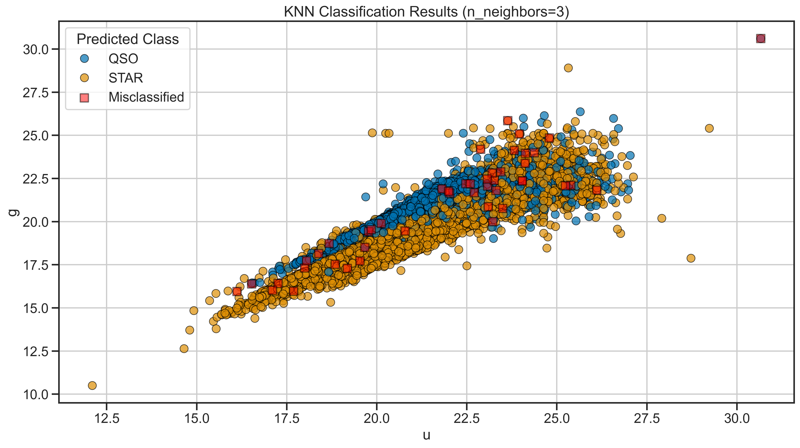

<!-- _class: title -->

# Day 02
## Classification with KNN and `scikit-learn`

MSU REU Machine Learning Short Course

---

# The Task

Given photometric measurements of an object, predict whether it is a **STAR**, **GALAXY**, or **QSO**.

- Yesterday: we *explored* the data
- Today: we *model* it

The model learns a **decision boundary** — a rule in feature space that separates classes.

---

# The ML Pipeline

Every model you build this week follows this same structure.


Learn it once. It applies to classification *and* regression.

---

# Train / Test Split and Scaling

**Why split?** You can't evaluate yourself on the data you learned from.

```python
from sklearn.model_selection import train_test_split
from sklearn.preprocessing import StandardScaler

X_train, X_test, y_train, y_test = train_test_split(
    X, y, test_size=0.2, random_state=42
)

scaler = StandardScaler()
X_train = scaler.fit_transform(X_train)
X_test  = scaler.transform(X_test)      # same scale as train
```

**Why scale?** KNN uses distance. A feature with range 0–1000 dominates one with range 0–1.

---

<!-- _class: img-full -->

# KNN — You are your neighbors

To classify a new point, find the *k* closest training points and take a majority vote.


---

# Evaluation — The Confusion Matrix

Accuracy alone hides the interesting failures.


**Precision** — when I say YES, how often am I right?
**Recall** — of all real YESes, how many did I find?
**F1** — harmonic mean of the two

---

<!-- _class: img-full -->

# Redshift changes everything

Without redshift: STAR vs QSO is hard. With it: near perfect.



> Ask yourself: *why* does redshift help so much?

---

# Today's Activity

Work through **Activity 02: Classification with scikit-learn**

1. Build a 2-class KNN (STAR vs QSO) without redshift
2. Tune *k* and observe the effect on performance
3. Add redshift — compare the confusion matrices
4. Extend to 3-class (STAR, GALAXY, QSO)

> **Notes:** [Methods & Validation](../notes/methods_and_validation.ipynb) · [Support Vector Machines](../notes/svm.ipynb)
