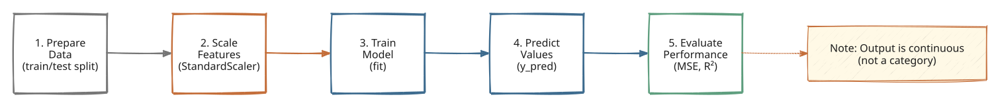
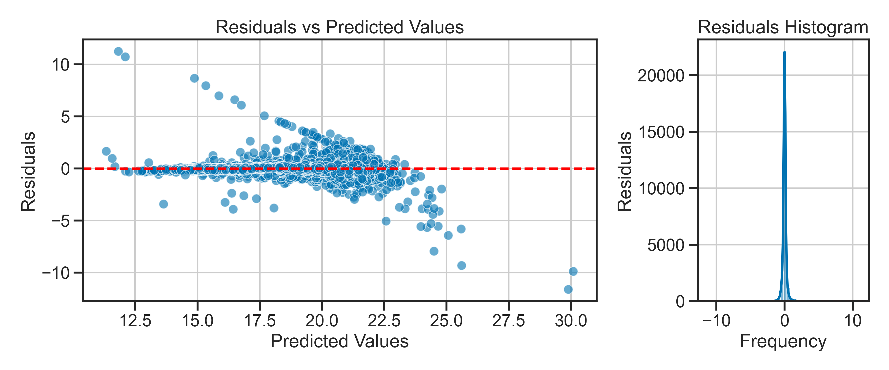
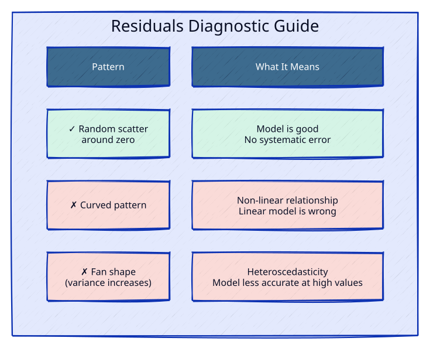
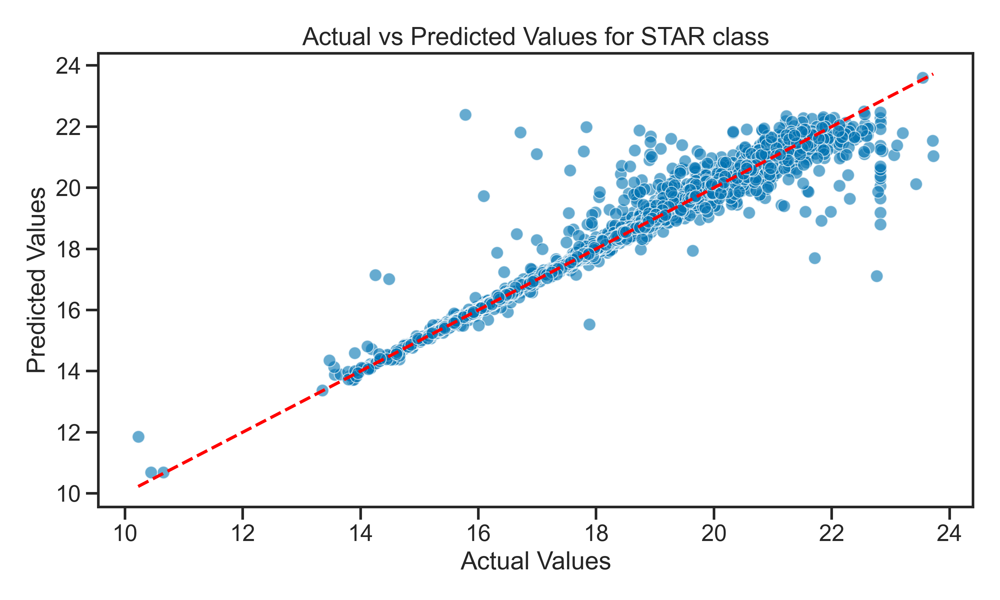
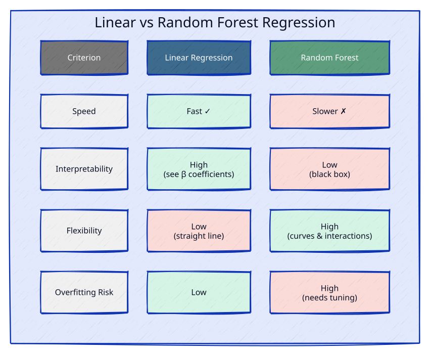

<!-- _class: title -->

# Day 03: Regression with `scikit-learn`
## Predicting continuous values

MSU REU Machine Learning Short Course

---

# Learning Goals for Today

By the end of this activity, you'll be able to:

1. **Distinguish regression from classification** — when each is the right tool
2. **Build and train a linear regression model** using the same pipeline as classification
3. **Evaluate regression models** with MSE, $R^2$, and diagnostic residual plots
4. **Diagnose what your model is missing** by reading residuals
5. **Compare different regression models** (Linear vs Random Forest)
6. **Improve a model** by adding features and per-class approaches

*This is the same workflow as classification.* The only difference: **you're predicting a number, not a category.**

---

# Which Approach Should I Use?

| | Classification | Regression |
|---|---|---|
| **Question** | "What is this?" | "How much?" |
| **Output** | A category (STAR, GALAXY, QSO) | A number (z-magnitude, temperature) |
| **Example** | Classify a spectrum as a star or quasar | Predict the brightness of that star |

**Your research question determines your approach.**

> We are doing supervised learning. *Unsupervised learning*, *clustering*, and *dimensionality reduction* are different tools for different questions.

---

# When Do We Use Regression?

Beyond classification, we often need to make **continuous predictions**:

| Problem | Features | Target |
|---|---|---|
| **Stellar brightness** | Colors (u, g, r, i, z) | Magnitude (0–30) |
| **Molecular energy** | Atomic structure | Bond energy (continuous) |
| **Star temperature** | Spectral absorption lines | Temperature (K) |
| **Galaxy redshift** | Brightness + colors | Redshift z (0–7) |

**Key insight:** When you need a precise number, not just a category, regression is your tool.

---

# Linear Regression: The Simplest Model


Fit a straight line (or plane, or hyperplane) through the data.

## Prediction formula:

$$\hat{y} = \beta_0 + \beta_1 x_1 + \beta_2 x_2 + \ldots + \beta_n x_n$$

Where:
- $\hat{y}$ = predicted value
- $x_i$ = features (colors, spectrum)
- $\beta_i$ = learned weights (how much each feature matters) - often collected as a "weights vector": $\boldsymbol{\beta}$

**Goal:** Find coefficients $\beta_i$ that minimize error. You are free to choose how to measure error, but the most common choice is **Mean Squared Error (MSE)**. 

---

# Measuring Error in Regression

## What is a residual?
$$\text{residual} = \text{predicted} - \text{actual}$$

Large residual = bad prediction. Small residual = good prediction.

## Why minimize *squared* error (MSE)?
- Penalizes big mistakes harder than small ones
- Mathematically convenient (smooth, differentiable)
- Interpretable: MSE is in *squared* units of your target (e.g., if predicting magnitude, MSE is in magnitude$^2$).

---

# The Regression Pipeline



**Identical to classification**: Prepare → Scale → Train → Predict → Evaluate

The only difference: your target is continuous, not categorical.

---

# Building the Model (Still the Same Pattern)

The `scikit-learn` workflow is **identical to KNN**:

```python
from sklearn.linear_model import LinearRegression
from sklearn.model_selection import train_test_split
from sklearn.preprocessing import StandardScaler

# 1. Prepare: split the data
X_train, X_test, y_train, y_test = train_test_split(X, y, test_size=0.2)

# 2. Scale: fit on training data only
scaler = StandardScaler()
X_train_scaled = scaler.fit_transform(X_train)
X_test_scaled = scaler.transform(X_test)
```

---

# Building the Model (Still the Same Pattern)

The `scikit-learn` workflow is **identical to KNN**:

```python
# 3. Train & Predict
model = LinearRegression()
model.fit(X_train_scaled, y_train)
y_pred = model.predict(X_test_scaled)

# 4. Evaluate
from sklearn.metrics import mean_squared_error, r2_score
print(r2_score(y_test, y_pred))
```

**Same structure, every time.**

---

# Evaluation: MSE and R²

**Mean Squared Error (MSE)** — average squared distance between predicted and actual
$$\text{MSE} = \frac{1}{n} \sum (y_{\text{true}} - y_{\text{pred}})^2$$
Lower is better. In same units as your squared target.

**R² (R-squared)** — fraction of variance explained
$$R^2 = 1 - \frac{\text{SS}_{\text{res}}}{\text{SS}_{\text{tot}}}$$

where $\text{SS}_{\text{tot}} = \sum (y_{\text{true}} - \bar{y})^2$ is the total variance in the data.

- 1.0 = perfect fit; 0.95 = explains 95% of variance; 0.5 = explains 50% 
- 0.0 = no better than mean prediction


---

# A Warning: Anscombe's Quartet

## Four datasets. Identical means, variances, correlations, AND R² values.


> Identical statistics **do not** mean identical data. Always plot. Source: <https://en.wikipedia.org/wiki/Anscombe%27s_quartet>

---

# Diagnostic Plots: Reading Residuals

Always visualize three things:

1. **Residuals vs Predicted** — scatter plot: do residuals look random?
2. **Histogram of residuals** — distribution: is it centered at zero?
3. **Actual vs Predicted** — 45° line should align with your points



---



**Rule:** Residuals should look like **random noise** around zero.

If they have a pattern (curved, fanned, clustered), your model is missing something.

---

# When Residuals Tell You Something

## Your model doesn't fit
- **Curved pattern** → Relationship is non-linear (not a straight line)
- **Fan shape** → Error gets bigger at high values (heteroscedasticity)
- **Clustering** → Model works better for some groups than others

## What to do?
- Try a **different model** (Random Forest, polynomial)
- **Add more features** (maybe colors interact?)
- **Separate by class** (STAR and GALAXY have different color-brightness relationships)

---

# When Linear Isn't Enough

**Same data, same question. Different model.**



---

# When Linear Isn't Enough

Random Forest can capture **non-linear patterns** — curves, interactions, complexity that linear models miss.

Same `scikit-learn` API:

```python
from sklearn.ensemble import RandomForestRegressor

model = RandomForestRegressor(n_estimators=100, random_state=42)
model.fit(X_train_scaled, y_train)
y_pred = model.predict(X_test_scaled)
```

---



---

# Model Comparison: Linear vs Random Forest

**Linear regression** assumes a straight line. Fast, interpretable, fails on curves.

**Random Forest** is flexible but slower and prone to overfitting.

**Which to use?** Visualize your residuals first. If they're curved, try Random Forest. If they're random, Linear might be enough.

---

# Does Redshift Dominate Here Too?

| Without redshift | With redshift |
|---|---|
| Low R$^2$ (colors alone are weak predictors) | High R$^2$ (redshift correlates with magnitude) |
| Colors matter | But is it "cheating"? |

**Key question:** Adding redshift improves R$^2$, but does the model learn color-magnitude relationships, or just memorize redshift?

**Your job:** Compare residuals with and without redshift. Does one have obvious patterns?

---

# Today's Activity: Regression with scikit-learn

Work through **Activity 03** step by step:

## Part 1: Baseline Linear Model
- Load SDSS data (100k objects, 17 features)
- Predict **z-band magnitude** from colors (u, g, r, i)
- Evaluate with **MSE, R²**

## Part 2: Diagnose with Residuals
- Plot residuals vs predicted
- Is there a pattern? Curved? Fanned out?
- What does that tell you?

---

# Today's Activity: Regression with scikit-learn

Work through **Activity 03** step by step:

## Part 3: Add Information
- Add **redshift** as a feature
- Compare R² before and after
- Do residuals look better? Why?

## Part 4: Different Approach
- Build **per-class models** (STAR, GALAXY, QSO separately)
- Compare accuracy per class
- Trade-off: flexibility vs sample size per model

---

# Today's Activity: Regression with scikit-learn

Work through **Activity 03** step by step:

## Part 5: Beyond Linear
- Try **Random Forest Regression**
- Compare performance to Linear
- Why might it be better? Overfitting risk?

> **The goal:** Understand the whole workflow. Pick one question that interests you and dig deep.

> **Notes:** [The Importance of Visualization](../notes/importance_of_visualization.ipynb) · [Methods & Validation](../notes/methods_and_validation.ipynb)
