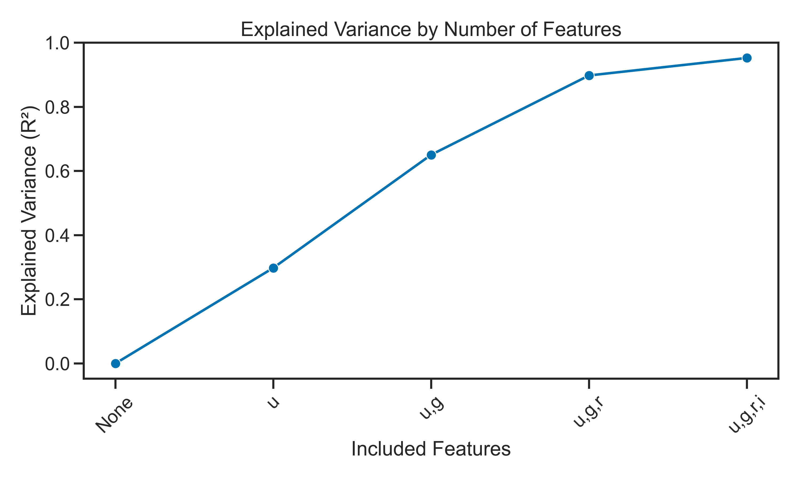
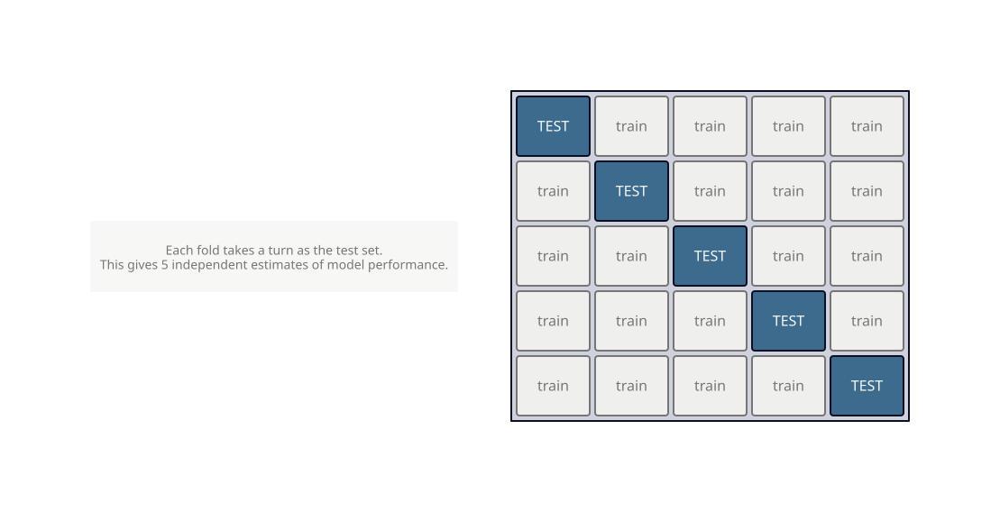

<!-- _class: title -->

# Day 04
## The Modeling Project

MSU REU Machine Learning Short Course

---

# The Full ML Loop

You've seen each piece. Today you run the whole thing yourself.


There is no single right answer. The goal is a *better* model, not a perfect one.

---

<!-- _class: img-full -->

# Today's Dataset — Molecular Atomization Energy

Predict the energy required to pull a molecule apart, from its atomic structure.


**1275 features** from the Coulomb matrix representation of each molecule. Most of them are noise.

---

# Start with a terrible model

Build the simplest possible model first.

```python
from sklearn.linear_model import LinearRegression
from sklearn.model_selection import train_test_split

X_train, X_test, y_train, y_test = train_test_split(X, y, test_size=0.2)

model = LinearRegression()
model.fit(X_train, y_train)
print(r2_score(y_test, model.predict(X_test)))   # probably bad
```

Then explore the data to understand *why* it's bad.
**Hint:** plot a histogram of each feature. What do you notice?

---

<!-- _class: img-full -->

# Feature selection — less is more

Not all 1275 features carry signal. Recursive Feature Elimination finds which ones to keep.



> See: [Recursive Feature Elimination](../notes/reverse-feature-elimination.ipynb)

---

# Cross-validation — how confident are you?

One train/test split gives you one number. Run the model many times to get a *distribution*.



> See: [Cross-Validation](../notes/cross-validation.ipynb)

---

<!-- _class: img-full -->

# Dimensionality reduction — PCA

1275 correlated features → a small number of uncorrelated components that capture most of the variance.


> See: [Principal Component Analysis](../notes/05_pca.ipynb)

---

# Today's Activity

Work through **Activity 04: Modeling Project** — open-ended by design.

1. Load the molecular energy dataset
2. Build an initial model — expect it to be bad
3. Explore: why is it bad? Remove useless features.
4. Re-evaluate. Does it improve?
5. Implement cross-validation to estimate performance with uncertainty.

> **Notes:** [Cross-Validation](../notes/cross-validation.ipynb) · [RFE](../notes/reverse-feature-elimination.ipynb) · [PCA](../notes/05_pca.ipynb)
>
> Use everything from Days 1–3. Ask questions. Improve iteratively.
