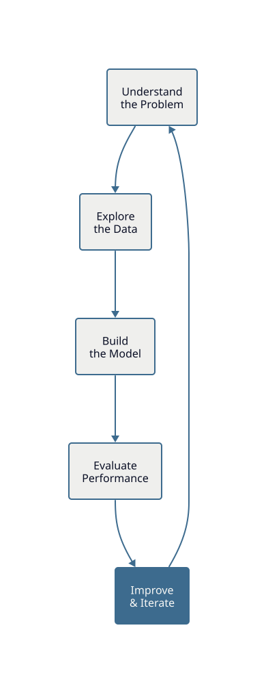
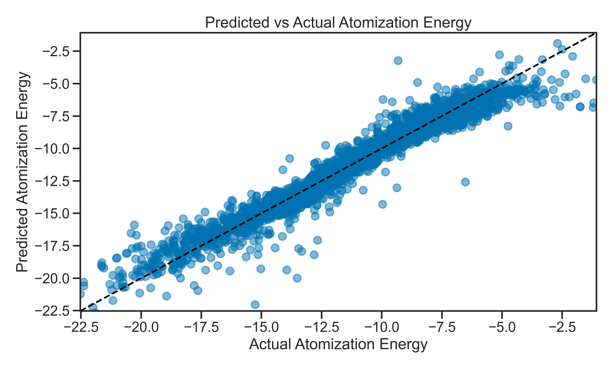
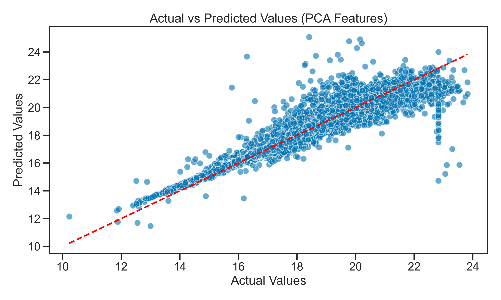

<!-- _class: title -->

# Day 04
## The Modeling Project

MSU REU Machine Learning Short Course

---

# The Full ML Loop

Days 1–3: Each piece separately. **Today: You run the entire loop yourself.**



**Key insight:** There is no single right answer. The goal is a *better* model, not a perfect one.

Real data science is iteration: try something, measure it, diagnose the bottleneck, try something else.

---

<!-- _class: img-full -->

# Today's Dataset — Molecular Atomization Energy

Predict the energy required to pull a molecule apart, from its atomic structure.



**1275 features** from the Coulomb matrix representation of each molecule.

**Real-world challenge:** Most features are noise. Your job: find the signal.

---

# Why This Dataset is Different

| | SDSS (Days 1–3) | Molecular Energy (Today) |
|---|---|---|
| **Size** | 100k objects | 1275 features each |
| **Features** | 17 (clean, well-understood) | 1275 (mostly noise) |
| **Problem** | Which features matter for classification? | How do you even start? |

**Day 1–3:** You could visualize all features, understand relationships.

**Today:** 1275-dimensional space. You can't visualize it. You need systematic methods.

---

# The Curse of Dimensionality

## What happens when you have many features?

- **More features = more parameters** — easier to fit noise, not just signal
- **Overfitting risk increases** — with 1275 features, a linear model can fit random data perfectly
- **Computational cost** — training takes longer
- **Interpretability collapse** — what do 1275 learned weights mean?

**The goal:** Remove noise, keep signal. Go from 1275 → ~50 features that actually matter.

---

# Overfitting vs Underfitting: The Goldilocks Problem


**Underfitting:** Model too simple. Misses real patterns. High bias.

**Overfitting:** Model memorizes noise. Fails on new data. High variance.

**Goldilocks zone:** Model is complex enough to capture signal, but simple enough to generalize.

---

# Why Start with a Terrible Model?

**Build the simplest possible model first. Expect it to fail.**

This is your **diagnostic baseline**. Failure teaches you where to improve.

```python
from sklearn.linear_model import LinearRegression
from sklearn.model_selection import train_test_split
from sklearn.metrics import r2_score

X_train, X_test, y_train, y_test = train_test_split(X, y, test_size=0.2)

model = LinearRegression()
model.fit(X_train, y_train)
r2 = r2_score(y_test, model.predict(X_test))
print(f"R² = {r2:.3f}")  # probably terrible (e.g., 0.15)
```

**The bad R² tells you:** "Something's wrong. What?"

Then explore: Are features useful? Noisy? Redundant? That's your improvement direction.

---

# Feature Selection: Art and Science

Not all 1275 features carry signal. Systematic methods find which ones to keep.


**Approaches:**
- **Recursive Feature Elimination (RFE):** Iteratively remove least important features
- **Domain knowledge:** Use physics intuition (some features are obviously useless)
- **Correlation threshold:** Remove redundant features (e.g., if two features are 99% correlated, keep one)

> See: [Recursive Feature Elimination](../notes/reverse-feature-elimination.ipynb)

---

# Cross-Validation: More Robust Confidence

One train/test split = one number = could be lucky or unlucky.

**K-fold cross-validation:** Run the model k times, get k scores, average them.


**Example with k=5:**
- Fold 1: Train on 80%, test on 20%
- Fold 2: Train on different 80%, test on different 20%
- ... (repeats 5 times)
- Average the 5 R² scores

**Benefit:** More robust. One unlucky split won't fool you. You get a distribution, not a single number.

```python
from sklearn.model_selection import cross_val_score

scores = cross_val_score(model, X, y, cv=5, scoring='r2')
print(f"R² = {scores.mean():.3f} ± {scores.std():.3f}")  # mean and confidence
```

> See: [Cross-Validation](../notes/cross-validation.ipynb)

---

<!-- _class: img-full -->

# Dimensionality Reduction: PCA (Principal Component Analysis)

**The problem:** 1275 correlated features. Many measure the same thing.

**The solution:** Find directions of maximum variance. Compress 1275 → 50 components.



**What's happening?** PCA finds new axes (components) where data spreads out most. First 50 PCs often capture 95% of variance.

**Trade-off:**
- Lose interpretability (what does "PC17" mean?)
- Gain efficiency (fewer numbers to work with)
- Often improves generalization (noise gets compressed out)

```python
from sklearn.decomposition import PCA

pca = PCA(n_components=50)
X_pca = pca.fit_transform(X_train)
print(pca.explained_variance_ratio_.cumsum())  # how much variance explained?
```

> See: [Principal Component Analysis](../notes/05_pca.ipynb)

---

# The Iteration Loop: How Real Data Science Works


**This is not a linear process.** You build, evaluate, diagnose, fix, repeat.

**Each iteration teaches you:**
- Where your model fails (residuals)
- Which features matter (coefficients, feature importance)
- How confident you should be (cross-validation scores)

**When to stop?** When you understand your model and its limitations, even if it's not perfect.

---

# Common Pitfalls: What Will Bite You

1. **Using all features** — Linear Regression with 1275 features will overfit
2. **Tuning hyperparameters on test data** — Data leakage! Breaks your honest evaluation
3. **Trusting training accuracy** — Always check test performance
4. **Forgetting to scale** — Feature scaling matters here too
5. **No visualization** — Plot residuals, feature distributions, correlations

**Prevention:** Follow the pipeline. One step at a time. Visualize everything.

---

# Today's Activity: Modeling Project

Work through **Activity 04: Modeling Project** — *open-ended by design*.

## Step 1: Baseline (Expect Failure)
- Load the molecular energy dataset (1275 features)
- Build a simple Linear Regression with *all* features
- Check R² on test data. Probably bad (~0.2). That's fine — it's diagnostic.

## Step 2: Explore & Diagnose
- Plot feature distributions: what's normal? What's skewed?
- Check feature correlations: are some redundant?
- Diagnose: where is your model failing?

## Step 3: Try an Improvement
- **Option A:** Remove useless features (RFE or correlation threshold)
- **Option B:** Use PCA to compress 1275 → 50 components
- **Option C:** Try a different model (Random Forest, Ridge regression)
- **Pick one and go deep.** Don't try everything.

## Step 4: Evaluate with Confidence
- Use **cross-validation** (not just train/test split)
- Report: Mean ± Std of cross-validation scores
- Compare before/after. Did you improve?

## Step 5: Iterate (If Time)
- What did you learn? What's still broken?
- Try another fix
- Can you push R² higher?

> **The goal:** Understand the full loop. Build something, measure it, improve it.
> You don't need a perfect model — you need to understand *why* it works or fails.

> **Notes:** [Cross-Validation](../notes/cross-validation.ipynb) · [RFE](../notes/reverse-feature-elimination.ipynb) · [PCA](../notes/05_pca.ipynb)
>
> **Real tip:** Ask questions. Discuss with neighbors. This is research.
